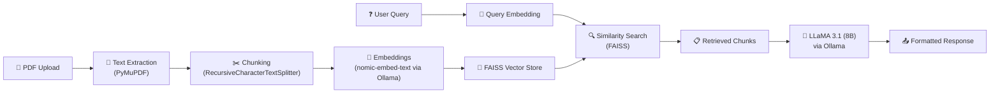

# AI-Powered Study Assistant using RAG

Build a complete RAG-based study assistant as a **Streamlit web application** in `d:\Uni\NLP\Project`. The system lets students upload PDFs, index them into a FAISS vector store, and interact with the material through Q&A, summaries, MCQs, and simplified explanations — all powered by **LLaMA 3.1 (8B)** via Ollama.

---

## Environment Snapshot

| Item | Status |
|---|---|
| Python | 3.12.0 ✅ |
| Ollama | 0.21.2 ✅ |
| LLM model | `llama3.1:8b` ✅ (already pulled) |
| Embedding model | `nomic-embed-text` ❌ (needs `ollama pull`) |
| PyMuPDF | 1.27.2 ✅ |
| Flask | 3.1.3 ✅ (won't use — Streamlit preferred) |
| LangChain / FAISS / Streamlit | ❌ (need to install) |

---

## User Review Required

> [!IMPORTANT]
> **Frontend choice — Streamlit**: I'm proposing **Streamlit** as the UI framework. It provides a polished, interactive web UI out of the box and is the de-facto standard for Python AI/ML demos. It is far richer than Flask templates for this kind of project and requires zero frontend code. If you prefer Flask or Gradio instead, let me know.

> [!IMPORTANT]
> **LLM model**: Your spec mentions "LLaMA 3" but your Ollama has `llama3.1:8b` pulled. I'll use **llama3.1:8b** since it's the successor and already available. Is that acceptable?

> [!WARNING]
> **Embedding model pull**: `nomic-embed-text` is not yet pulled in Ollama. I will run `ollama pull nomic-embed-text` as part of setup (~274 MB download). This is required for the vector embeddings.

---

## Open Questions

> [!IMPORTANT]
> **Sample documents for demo**: Your `Slides` folder has 7 NLP-related PDFs. Should I pre-index these as demo content, or start with a blank slate where users upload their own?

---

## Architecture



---

## Proposed File Structure

```
d:\Uni\NLP\Project\
├── app.py                    # Streamlit main application
├── rag_pipeline.py           # Core RAG logic (ingest, retrieve, generate)
├── prompts.py                # All prompt templates (QA, Summarize, MCQ, ELI5)
├── config.py                 # Configuration constants
├── requirements.txt          # Python dependencies
├── vectorstore/              # Persisted FAISS index (auto-created)
└── README.md                 # Project documentation
```

---

## Proposed Changes

### Dependencies

#### [NEW] [requirements.txt](file:///d:/Uni/NLP/Project/requirements.txt)

```
streamlit>=1.40.0
langchain>=0.3.0
langchain-community>=0.3.0
langchain-ollama>=0.2.0
faiss-cpu>=1.9.0
pymupdf>=1.25.0
```

Installed via: `pip install -r requirements.txt`

Plus: `ollama pull nomic-embed-text`

---

### Configuration

#### [NEW] [config.py](file:///d:/Uni/NLP/Project/config.py)

Central configuration file containing:

- **LLM settings**: model name (`llama3.1:8b`), temperature (0.3 for factual answers), base URL
- **Embedding settings**: model name (`nomic-embed-text`), base URL  
- **Chunking settings**: chunk size (1000 chars), overlap (200 chars)
- **Retrieval settings**: top-k results (4), similarity threshold
- **Paths**: vector store directory

---

### Prompt Templates

#### [NEW] [prompts.py](file:///d:/Uni/NLP/Project/prompts.py)

Four structured prompt templates following the exact output format specified in the requirements:

| Mode | Prompt Behavior |
|---|---|
| **Q&A** (default) | Answer with ✅ Answer, 📌 Key Points, 📖 Source Insight sections |
| **Summarize** | Concise summary with main themes, key concepts, and important details |
| **Make MCQs** | Generate 3–5 MCQs with 4 options each and an answer key |
| **Explain Simply** | ELI5-style explanation with analogies and simple language |

All prompts include the strict instructions: no hallucination, context-only answers, "answer not available" fallback.

---

### RAG Pipeline

#### [NEW] [rag_pipeline.py](file:///d:/Uni/NLP/Project/rag_pipeline.py)

The core engine with these components:

**`StudyAssistant` class** with:

1. **`load_and_chunk_pdfs(files)`**
   - Extract text from uploaded PDFs using PyMuPDF (`fitz`)
   - Split into chunks using `RecursiveCharacterTextSplitter` (1000 chars, 200 overlap)
   - Attach metadata (filename, page number) to each chunk

2. **`build_vectorstore(chunks)`**
   - Generate embeddings using `OllamaEmbeddings(model="nomic-embed-text")`
   - Build FAISS index from chunks
   - Persist to disk at `vectorstore/` for reuse across sessions

3. **`load_vectorstore()`**
   - Load existing FAISS index from disk if available

4. **`retrieve(query, k=4)`**
   - Convert query to embedding
   - Perform similarity search in FAISS
   - Return top-k relevant chunks with metadata

5. **`generate(query, mode="qa")`**
   - Retrieve relevant chunks
   - Select appropriate prompt template based on mode
   - Call LLaMA 3.1 via `ChatOllama`
   - Return formatted response

---

### Streamlit Application

#### [NEW] [app.py](file:///d:/Uni/NLP/Project/app.py)

A polished, modern Streamlit UI with:

**Sidebar:**
- 📄 PDF upload area (multi-file, drag-and-drop)
- "🔄 Process Documents" button to trigger ingestion
- Progress bar during processing
- List of indexed documents
- Status indicators (how many chunks, documents indexed)

**Main Area:**
- Title with gradient styling and emoji branding
- **Mode selector** (radio buttons): Q&A | Summarize | Make MCQs | Explain Simply
- Chat-style input area
- Formatted response display with markdown rendering
- Source document references with expandable details
- Session history of past queries

**Styling:**
- Custom CSS injected via `st.markdown` for:
  - Dark/modern theme overrides
  - Gradient header
  - Card-style response containers
  - Smooth animations on response display
  - Custom fonts (Inter via Google Fonts)

---

### Documentation

#### [NEW] [README.md](file:///d:/Uni/NLP/Project/README.md)

Project documentation with:
- Project overview and features
- Setup instructions (prerequisites, installation, model pull)
- Usage guide with screenshots
- Architecture diagram
- Technical details

---

## Verification Plan

### Automated Tests

1. **Dependency installation**: `pip install -r requirements.txt` completes without errors
2. **Ollama model check**: `ollama list` shows both `llama3.1:8b` and `nomic-embed-text`
3. **Application launch**: `streamlit run app.py` starts without errors

### Functional Testing (Browser)

1. **Upload flow**: Upload a PDF from the Slides folder → verify chunks are created and indexed
2. **Q&A mode**: Ask a question about uploaded content → verify structured response with Answer/Key Points/Source Insight
3. **Summarize mode**: Request summary → verify concise summary output
4. **MCQ mode**: Request MCQs → verify 3-5 well-formed questions with options
5. **ELI5 mode**: Request simple explanation → verify beginner-friendly language
6. **Hallucination guard**: Ask an unrelated question → verify "answer not available" response
7. **Persistence**: Restart app → verify vector store is loaded from disk

### Manual Verification
- Visual inspection of the Streamlit UI for polish and usability
