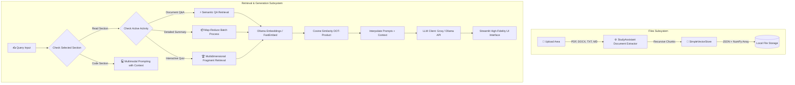

# AI-Powered Study Assistant — Completed Implementation Report

The AI-powered RAG Study Assistant is **fully implemented** and operates as a unified, high-performance, and visually gorgeous academic application in Streamlit. The system allows students to upload multiple source documents, index them securely on their local disk using a custom-engineered mathematical vector store, and interact with the materials using advanced Retrieval-Augmented Generation (RAG).

---

## 🏗️ Core Architecture Overview

---

## 🛠️ Implemented Systems Deep-Dive

### 1. Robust File Ingestion Subsystem (`rag_pipeline.py`)
- **PyPDF Extraction**: Reads PDF documents page-by-page, captures corresponding page number metadata, and parses text securely into standard python strings.
- **Office Word XML Parser**: Utilizes the native python standard library (`zipfile` and `xml.etree.ElementTree`) to scan Word elements in `word/document.xml` sequentially and stitch paragraph runs into a complete text representation.
- **Robust Character Encoder**: Recovers raw document text streams safely, correcting broken decodings and falling back to replacement blocks (`errors="replace"`) to prevent parsing lockups.
- **Recursive Character Chunking**: A pure Python text chunker recursive-splits content sequentially on predefined semantic separators (e.g., `\n\n`, `\n`, `. `, `" "`) keeping chunk sizes constrained below 1000 characters and preserving a 200-character overlapping context margin between adjacent segments.

### 2. Custom Pure-Python Vector Database (`rag_pipeline.py`)
- **NumPy Matrix Operations**: Bypasses heavy compiler dependencies, OS library roadblocks, and locked C++ DLL runtimes by implementing a **pure Python vectorized similarity database** (`SimpleVectorStore`).
- **Normalized Cosine Similarity**: Normalizes query and database embedding vectors to unit lengths before executing dot-products (`embeddings_normalized @ q_normalized`) to guarantee mathematical equivalence with standard cosine similarity metrics.
- **Secure Cross-Platform Persistence**: Abandons standard serialization libraries like Pickle (which can execute arbitrary malicious code upon load) in favor of **native JSON arrays** for document metadata, paired with **raw float32 binary `.npy` arrays** for embedding matrices. Includes automated legacy Pickle load fail-safes for backwards compatibility.

### 3. Comprehensive Batch Summarization (Map-Reduce Engine)
- **Automatic Intake Batching**: Collects all document segments and clusters them into distinct, tightly bounded block structures (~30 chunks each) to guarantee context window limits (preventing HTTP `413 Request Entity Too Large` payloads).
- **Map Extraction**: Processes each logical chunk cluster sequentially through the LLM, extracting terms, mathematical formulas, definitions, and distinct bullet points.
- **Reduce Synthesizing**: Feeds all individual block lists back to the LLM inside a merge prompt, merging them into a beautifully structured, comprehensive, exam-ready study manual without any details getting dropped.

### 4. Interactive Graded Assessment Form (`app.py`)
- **Diverse Retrieval Sampling**: Samples up to 15 diverse material chunks to supply LLaMA with a rich, multidimensional dataset.
- **Pure JSON Validation**: Forces the LLM to return exactly 10 multiple-choice questions within a strict, raw JSON array (automatically stripping out markdown wrappers or trailing comments).
- **Live Streamlit Form**: Spawns clean radio buttons, permitting students to select options at their own pace.
- **Scorecard Engine**: Calculates points, percentages, and outputs contextual Pass/Fail notifications (recommending study reviews if the grade drops under 50%).
- **Interactive Explanations**: Generates individual feedback cards colored according to answer correctness, displaying what you selected, the correct choice, and LLaMA's explanation.

### 5. Multimodal Coding Mode (`app.py` & `prompts.py`)
- **Multimodal Visual References**: Permits pasting (Ctrl+V) or uploading reference screenshots (like error traces or compiler outputs) and converts them to base64 inline, passing them to LLaMA (using the vision-enabled `llama-4-scout` model on Groq when images are present).
- **Dynamic Coding Tutor Prompt**: Adjusts its code generation output style dynamically, matching your programming conventions (bracing, naming casing, indentation) and keeping descriptions clear, beginner-friendly, and educational.

---

## 📊 Completed File Map

- **`config.py`**: Reads secrets and env vars; exposes provider models; configures chunk and context parameters.
- **`prompts.py`**: Tailors system instructions for standard Q&A (Answer/Points/References), Exam Summaries, Quiz Generation (JSON output), and Adaptive Coding Support.
- **`rag_pipeline.py`**: Extractor, Splitter, `SimpleVectorStore` NumPy DB, Ollama/Groq REST HTTP clients, Map-Reduce Summarizer, and Auto-welcome summary generator.
- **`app.py`**: Customized dark UI, ChatGPT-style sidebar (threads, disk-persistence, text-search, file deletion, metrics), and multi-mode activity routers.

---

## 🧪 Completed Test Suites & Verification

All pipeline capabilities are verified through multiple rigorous offline test suites:

1. **`smoke_groq.py`**: Validates fastembed local vectorization and Groq completion responses on mock schemas.
2. **`test_summary_only.py`**: Computes text similarity search over files and tests summary keyword coverage against expected study topics (NLP preprocessing, regex, stemmers).
3. **`test_all_modes.py`**: Triggers full pipelines over QA, Summary, Quiz JSON, and Programming activities, confirming correct response formats.
4. **`test_e2e.py`**: Executes end-to-end user flows, testing ingestion pipelines and verifying memory safety.

- Technical details

---

## Verification Plan

### Automated Tests

1. **Dependency installation**: `pip install -r requirements.txt` completes without errors
2. **Ollama model check**: `ollama list` shows both `llama3.1:8b` and `nomic-embed-text`
3. **Application launch**: `streamlit run app.py` starts without errors

### Functional Testing (Browser)

1. **Upload flow**: Upload a PDF from the Slides folder → verify chunks are created and indexed
2. **Q&A mode**: Ask a question about uploaded content → verify structured response with Answer/Key Points/Source Insight
3. **Summarize mode**: Request summary → verify concise summary output
4. **MCQ mode**: Request MCQs → verify 3-5 well-formed questions with options
5. **ELI5 mode**: Request simple explanation → verify beginner-friendly language
6. **Hallucination guard**: Ask an unrelated question → verify "answer not available" response
7. **Persistence**: Restart app → verify vector store is loaded from disk

### Manual Verification
- Visual inspection of the Streamlit UI for polish and usability
